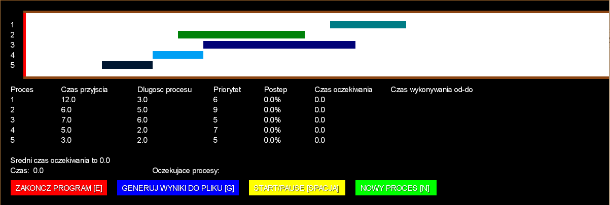
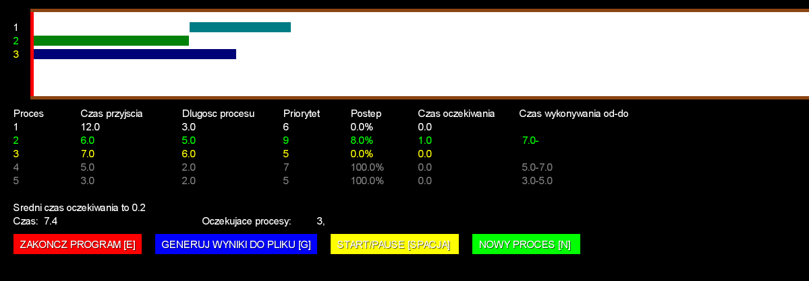

# PriorityProcessSimulation

CPU time scheduling simulation program with priority planning algorithms using process aging with or without expropriation of processes..

Application developed in Java and libGDX framework.

## Table of contents
* [ProcessSimulation](#processsimulation)
	* [Technologies](#technologies)
	* [Setup](#setup)
	* [Usage](#usage)
	* [Structure of source code](#structure-of-source-code)
	* [Implementation of processor time planning algorithms](#implementation-of-processor-time-planning-algorithms)
	* [Project report](#project-report)

## Technologies

* Java
* libGDX framework: https://libgdx.com/

## Setup

The project was generated by [Project Setup Tool](https://libgdx.com/dev/project-generation/). Also libGDX projects are [Gradle](http://www.gradle.org/) projects, which makes managing dependencies and building considerably easier.

You can download project's files from this repository. Then run in terminal `./gradlew desktop:run` to compile and start the application.

If you want to use your IDE and configure Gradle, see this instructions: https://libgdx.com/dev/import-and-running/.

To build this project I have used Eclipse with Gradle configuration.

## Usage

After starting the application, the first question to the user is whether to load data from the `data.txt` file or to randomize it. If the user wants to load data from a file, they must be in the following format:
>the text file should contain as many lines as there are intended processes. each line contains three integers separated by a single space. The first is the arrival time of the process, the second is its duration, and the third is priority.

If, in turn, the user wants to draw data, he only has to answer the question of how many processes should be randomly selected.

   

The next step is to choose the CPU allocation planning method, which is one of the following:
* with expropriation
* without expropriation.

   

After selecting a method, the program asks two questions. The first is: *what period of time should you age the waiting processes?* Every such period, the `balance()` function will be run, which will age the corresponding pending processes. The second question is: *how long does the process take to be aged?*

First question:
   

Second question:
   

After starting to the simulation, we see successive processes on the timeline and a table with further information about them:
* Process number
* Time of coming
* Process length
* Priority
* Progress (percent)
* Waiting time
* Execution time from-to (will show several intervals for expropriation algorithm, one for non-expropriation).

At any time, we can generate a report for the current state, we can stop the simulation or add a new process.

Simulation begin:
   

Simulation after some time:
   

## Structure of source code

There are four classes to in this application:
* Processor,
* PriorityProcessSimulation,
* Task,
* TextListener.

Their implementation is located at: `PriorityProcessSimulation/core/src/com/mygdx/game/`.

### `Processor` class

This is the most extensive class in the project. Responsible for loading processes, selecting the scheduling time algorithm, implementing this algorithm in time and generating data on the screen and to a file.

All processes are stored in the dynamic array processes, and the numbers of waiting processes are stored in the dynamic array `waitingProcesses`.

The numbers in this second table are stored in such a way that, if this array is not empty, the process contained therein at position zero is currently being executed and the rest will be executed in the order in which they appear in subsequent positions.

### `PriorityProcessSimulation` class
This is the main class of the design. At startup, it creates variables using constructors, and then in the `render()` function, which is responsible for generating subsequent frames of the application, it calls functions of the `Processor` class that are responsible for drawing the results on the screen and checking whether the user has selected any option by pressing button on keyboard or mouse on screen, time lapse and process handling.

### `Task` class
This is the class used to store data about a single process. It allows, among others to check its current position in the timeline, its execution progress and calculate the waiting time.

### `TextListener` class
It is a class created solely for the purpose of generating windows with a question to the user and enabling the reading of text. It has been used in such moments as loading the number of processes that need to be randomly selected, loading the length of a time quantum, what period of time to run the `balance()` function, and how long the process has to wait to be aged.

## Implementation of processor time planning algorithms

### `balance()` function

Using the for loop (line 3) application checks all processes in the dynamic array `waitingProcesses`. If they are currently expecting more than the time quantum given by the user, application is aging them (line 6). Then, on lines 8-17, application sorts this process array according to their priority.

	1.		private void balance() {
	2.	
	3.			for (int i = 1; i < waitingProcesses.size(); i++) {
	4.				// increase priority
	5.				if (processes.get(waitingProcesses.get(i)).currentWaitingTime(timer) > waitingTime) {
	6.					processes.get(waitingProcesses.get(i)).increasePriority();
	7.				}
	8.				Collections.sort(waitingProcesses.subList(startSorting, waitingProcesses.size()),
	9.						new Comparator<Integer>() {
	10.							public int compare(Integer o1, Integer o2) {
	11.								if (processes.get(o1).priority() < processes.get(o2).priority()) {
	12.									return -1;
	13.								} else {
	14.									return 1;
	15.								}
	16.							}
	17.						});
	18.			}
	19.		}

### Planning algorithm

The program has a variable `currentTimePart`, thanks to which you know how much time has passed since the last execution of the `balance()` function. This variable is incremented on line 7, and on lines 51-57 it is checked whether it has already reached the value provided by the user - at what intervals the `balance()` function is to be performed. If this value is already reached, apart from executing the `balance()` function, this variable is reset to zero to count the next period from the beginning.

Thanks to the for loop (line 4) application checks all processes. If any of them has just reached the arrival time and its number is not already in the `waitingProcesses` array, then application adds it to the appropriate place - so that the array is still sorted according to the process priorities. Application makes the appropriate conditions and adding to the array on lines 7-28.

On lines 41-43, application checks that the currently running process has not already been completed. If so, application removes it from the `waitingProcesses` array.

Whether application uses the expropriation or non-expropriation scheduling method is implemented on line 14. If the method is to prevent expropriation, the new process must not be placed in the zero position in the `waitingProcesses` array so as not to expropriate the process that is being executed there. . Therefore, the `startSorting` variable takes the value 1 then, otherwise, in the preemptive method, the `startSorting` variable is equal to 0 - the new process may take this position and expropriate the currently running process.

	1.		public void runProcess() {
	2.			if (isOn) {
	3.				currentTimePart += timeStep;
	4.				for (int i = 0; i < processes.size(); i++) {
	5.					if (processes.get(i).currentPosition(timer) == 0 && !waitingProcesses.contains(i)
	6.							&& !processes.get(i).isDone(timeStep)) {
	7.						if (waitingProcesses.isEmpty()) {
	8.							waitingProcesses.add(i);
	9.						} else {
	10.							// add this new process in the right place to the list
	11.							// keep sorted
	12.							if (waitingProcesses.size() > 1) {
	13.								boolean wasAdded = false;
	14.								for (int j = startSorting; j < waitingProcesses.size(); j++) {
	15.									if (processes.get(waitingProcesses.get(j)).priority() > processes.get(i).priority()) {
	16.										waitingProcesses.add(j, i);
	17.										wasAdded = true;
	18.										break;
	19.									}
	20.								}
	21.								if (!wasAdded) {
	22.									waitingProcesses.add(i);
	23.								}
	24.							} else {
	25.								waitingProcesses.add(i);
	26.							}
	27.						}
	28.					}
	29.				}
	30.	
	31.				if (!waitingProcesses.isEmpty()) {
	32.					if (lastRun == -1) {
	33.						processes.get(waitingProcesses.get(0)).addStartTime(timer);
	34.					} else if (lastRun != waitingProcesses.get(0)) {
	35.						processes.get(lastRun).addEndTime(timer);
	36.						processes.get(waitingProcesses.get(0)).addStartTime(timer);
	37.					}
	38.					lastRun = waitingProcesses.get(0);
	39.					processes.get(waitingProcesses.get(0)).increaseProgress(timeStep);
	40.	
	41.					if (processes.get(waitingProcesses.get(0)).isDone(timeStep)) {
	42.						waitingProcesses.remove(0);
	43.					}
	44.	
	45.				} else if (lastRun != -1) {
	46.					processes.get(lastRun).addEndTime(timer);
	47.					timeToEnd = timer;
	48.					lastRun = -1;
	49.				}
	50.	
	51.				if (currentTimePart >= timePart) {
	52.					balance();
	53.					currentTimePart = 0;
	54.				}
	55.			}
	56.		}

## Project report

I completed the laboratory task by writing an application called simulation1.exe in the `executable` folder. The project's source files are located in the `data_files` folder, and the data on which I tested the algorithms used are files in this folder named:
* data_1.txt,
* data_2.txt.
Reports generated for this data are stored in the following files:
* result_1.txt,
* result_2.txt.

### Algorithm without expropriation 

For the input data (`data_1.txt` file) results (`result_1.txt`):

| Process | Arriving time | Process length | Process priority | Waiting time | Progress | Running time from-to |
|---------|---------------|----------------|------------------|--------------|----------|----------------------|
| 0       | 1             | 9              | 5                | 0            | 100%     | 1,0-10,0             |
| 1       | 1             | 3              | 1                | 12           | 100%     | 13,0-16,0            |
| 2       | 7             | 2              | 0                | 4            | 100%     | 11,0-13,0            |
| 3       | 2             | 2              | 1                | 14           | 100%     | 16,0-18,0            |
| 4       | 2             | 1              | 0                | 8            | 100%     | 10,0-11,0            |

Method used: Priority scheduling without expropriation of processes every 3.0 waiting longer than 2.0.

Average waiting time: 7.6

Processes came to the processor in the order: 0, 4, 2, 1, 3. Processes waiting for more than 2 time units were aged every 3 time units. For such a short time interval, processes 2 and 4 achieved priority 0. Process number 4 was executed first because it had a faster arrival time. The remaining processes 1 and 3 at the time of their execution did not have an initial priority of 5, but only 1 because they were both aged 4 times.

### Algorithm with expropriation 

For the input data (`data_2.txt` file) results (`result_2.txt`):

| Process | Arriving time | Process length | Process priority | Waiting time | Progress | Running time from-to              |
|---------|---------------|----------------|------------------|--------------|----------|-----------------------------------|
| 0       | 1             | 9              | 4                | 8            | 100%     | 1,0-2,0 3,0-3,0 6,0-6,0 10,0-18,0 |
| 1       | 1             | 3              | 4                | 2            | 100%     | 3,0-6,0                           |
| 2       | 7             | 2              | 1                | 0            | 100%     | 7,0-9,0                           |
| 3       | 2             | 2              | 4                | 6            | 100%     | 6,0-7,0 9,0-10,0                  |
| 4       | 2             | 1              | 2                | 0            | 100%     | 2,0-3,0                           |

Method used: Priority scheduling without expropriation of processes every 3.0 waiting longer than 2.0.

Average waiting time: 3.2

To better be able to compare the two algorithms, I used the same inputs and parameters as for the `balance()` function. Process 0, which was the longest and low priority compared to other processes, was expropriated 3 times. Also trial number 3 was expropriated once.

### Summary

Based on the tests performed, I can conclude that the program correctly simulates the priority planning of the CPU time allocation.
It is worth noting that expropriation planning achieves a shorter average waiting time.

In my opinion, the implementation of these algorithms has been well illustrated also by the graphic part, because thanks to it we can check the status of each process on an ongoing basis - both the time of arrival, duration and, above all, priority. Thanks to the information in the runtime report from-to, we can also learn about any expropriation.

The program has the necessary functions to implement the given simulations. A possible path for its development is, among others the possibility of creating a larger database of performed tests, for example in order to compare the average waiting time of processes for a larger number of tests.
